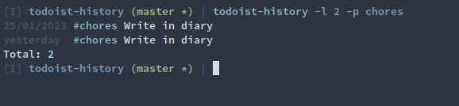

# Todoist history

A simple cli that does nothing else than outputting some completed task's in your terminal.



You need your todoist token at `~/.todoist.token`

Install:
```bash
sudo jpm install https://github.com/dghaehre/todoist-history
```

Now run:
```bash
todoist-history -h
```
